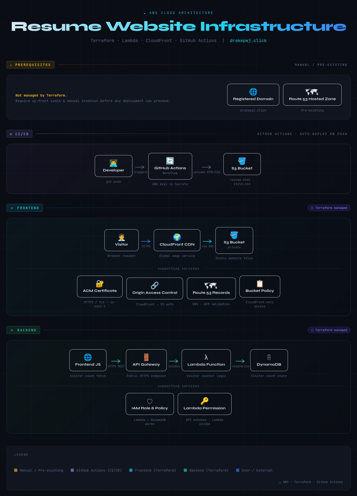

## A fully automated cloud deployment project using Terraform, AWS Lambda, API Gateway, DynamoDB, and GitHub Actions to provision, update, and maintain a multi‑component application: a cloud-hosted resume.

---

# RESOURCES 

## DOMAIN PREREQUISITES

This project requires:

- A registered domain
- A Route 53 hosted zone for that domain

These are not provisioned through Terraform because they require up‑front costs and manual creation.

---

## FRONTEND ARCHITECTURE (Terraform‑Managed)

- S3 Bucket - private storage for website files
- Origin Access Control (OAC) - allows CloudFront to securely access the S3 bucket
- CloudFront CDN - serves the website globally
- ACM Certificate - enables HTTPS for CloudFront
- Route 53 Records - DNS records connecting the domain, CloudFront, and ACM validation
- Bucket Policy - restricts S3 access so only CloudFront can read objects
- Dynamic URL Injection - Terraform writes the API and CloudFront URLs into the frontend files and syncs them to S3 so the site always references the correct resources

---

## BACKEND ARCHITECTURE (Terraform‑Managed)

- Lambda Function - increments and returns the visitor count
- IAM Role & Policy - grants Lambda read/write access to DynamoDB
- DynamoDB Table - stores the visitor count
- API Gateway - public HTTPS endpoint for the frontend to call the Lambda
- Lambda Permission - allows API Gateway to invoke the function

---

# SETUP

This project uses Terraform to deploy both the frontend (S3 + CloudFront + ACM + Route 53) and backend (Lambda + API Gateway).  
To deploy it in your own AWS account, you only need to provide:

- Your AWS region
- Your domain name
- Your Route 53 hosted zone ID

---

## 1. Prerequisites

Install and configure:

- AWS CLI
- Terraform

Have ready:

- A registered domain
- A Route 53 hosted zone for that domain

Do this:

- Clone the repository

---

## 2. Configure Your Variables

Copy variables.tf.example → variables.tf and fill in:

`region = "<your-aws-region>"`

`domain = "<your-domain>"`

`hosted_zone_id = "<your-hosted-zone-id>"`

Note:
CloudFront, OAC, and ACM are global services but must be deployed in us-east-1. Terraform handles this automatically; your chosen region only affects regional services like Lambda, API Gateway, and DynamoDB.

---

## 3. Deploy

Run:

terraform init
terraform apply

Terraform will create all frontend and backend resources. It will use AWS CLI to copy resume.html, style.css, and counter.js to the S# bucket. It will also push the API URL, region, and domain name to their respective files for GitHub Actions.

Your resume website will now be live.

---

## 4. Enable GitHub Actions (Optional)

This step enables automatic deployment of website updates.

The included GitHub Actions workflow uploads updated resume.html and style.css to the S3 bucket whenever you push changes.

To enable:

1. In your GitHub repo, go to Settings → Secrets and variables → Actions
2. Add:

   - AWS_ACCESS_KEY_ID
   - AWS_SECRET_ACCESS_KEY

3. Commit and push any change to the repository

This triggers the workflow and updates the website files.

IMPORTANT:
GitHub Actions does not run Terraform.
It only uploads the website files to S3.
Infrastructure changes still require running Terraform manually.

---

# DESTROY / RE‑DEPLOY

To redeploy the entire project from scratch:

### 1. Empty the S3 bucket

aws s3 rm s3://resume-YOURSITE.DOMAIN --recursive

If versioning is enabled, you may also need to delete object versions.

### 2. Destroy the infrastructure

terraform destroy

### 3. Re‑deploy

terraform apply

All resources in this project use usage‑based pricing, so destroying and re‑applying does not incur additional fixed costs.
